---
# You can also start simply with 'default'
theme: default
background: ./bg.jpg
title: Ergonomic Keyboards
# apply unocss classes to the current slide
class: text-center
# https://sli.dev/features/drawing
drawings:
  persist: false
# slide transition: https://sli.dev/guide/animations.html#slide-transitions
transition: fade
# enable MDC Syntax: https://sli.dev/features/mdc
mdc: true
---

# Эргономика и клавиатуры

---

# О чём поговорим?

<v-clicks>

- Об эргономике рабочего места и об эргономике в целом.
- Обсудим проблемы современных (и не очень) клавиатур.
- Рассмотрим то, как решаются эти проблемы.

</v-clicks>

---

# Эргономика

от греческого:

> `ergon` — работа
>
> `nomos` — закон

<v-clicks>

Это **научная дисциплина**, изучающая оптимизацию

- эффективности,
- безопасности
- и комфорта

при взаимодействии человека

- с техникой,
- оборудованием
- и окружающей средой

</v-clicks>

<!--
  Давайте посмотрим, что такое Эргономика на примерах
-->

---

# Что такое эргономика?

на примерах

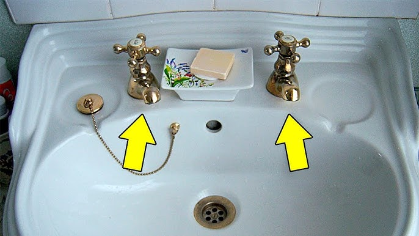

<!--
0.5 min

В Великобритании из-за особенностей старой застройки, по сегодняшний день
распространена система независимых кранов для холодной и горячей воды.

Чтобы умыться, вы затыкаете слив, набираете воду в раковину и умываетесь.

-->

---

# Что такое эргономика?

на примерах

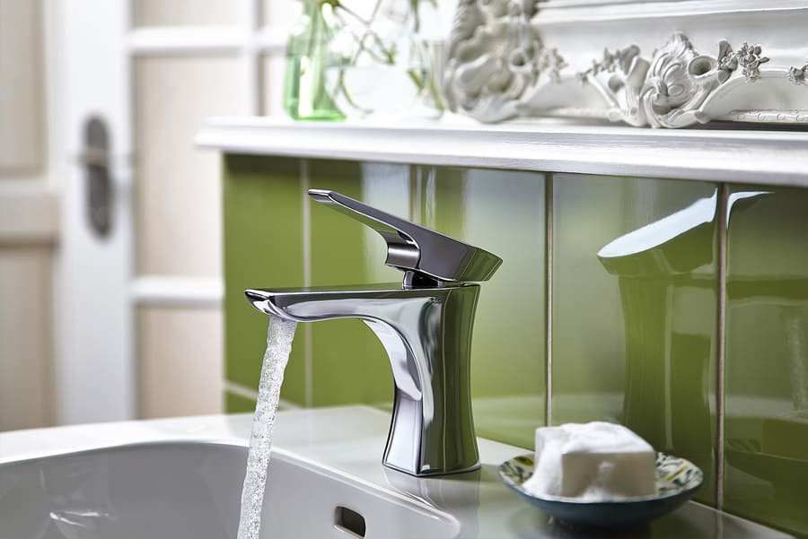

<!--
0.5 min

Согласитесь, звучит крайне неудобно, особенно в сравнении с нашими смесителями,
где одним лёгким движением руки, вы можете регулировать как напор, так и температуру.

Я уж не говорю о кранах с термостатом, где можно заранее выставить нужную температуру.

Такие краны более эргономичны, потому что значительно улучшают ваш комфорт.

-->

---

# Что такое эргономика?

на примерах

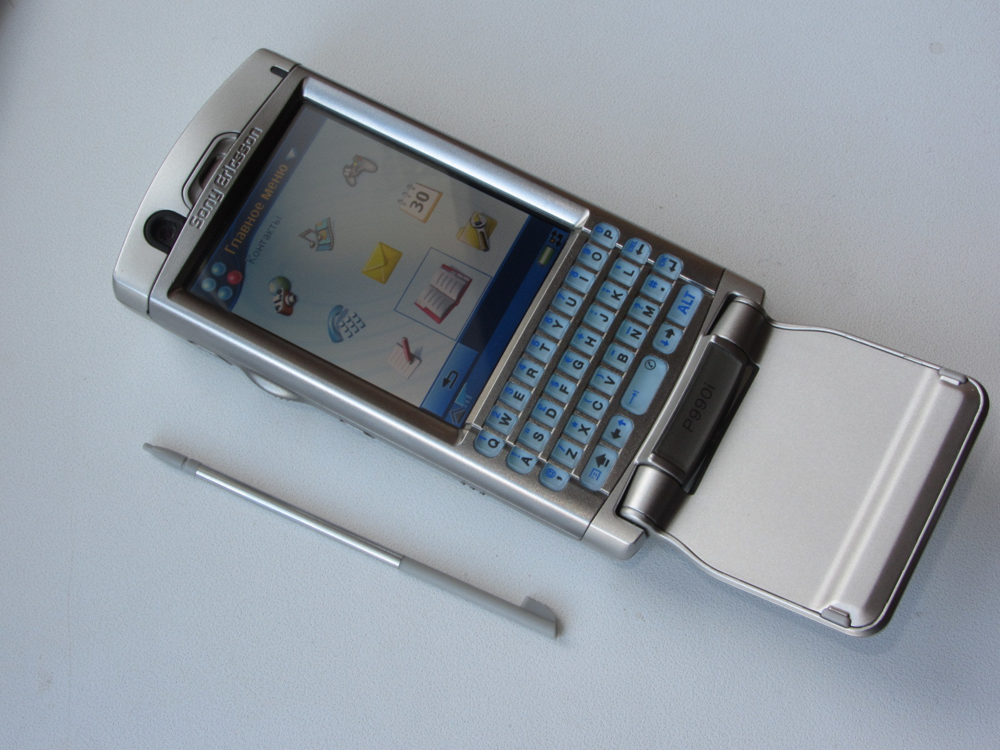

<!--
0.5 min

Или, быть может, кто-то вспомнит телефоны или КПК с резистивным типом сенсорного экрана...

Чтобы управлять таким экраном приходилось держать в руке специальный стилус и нажимать им.

-->

---

# Что такое эргономика?

на примерах

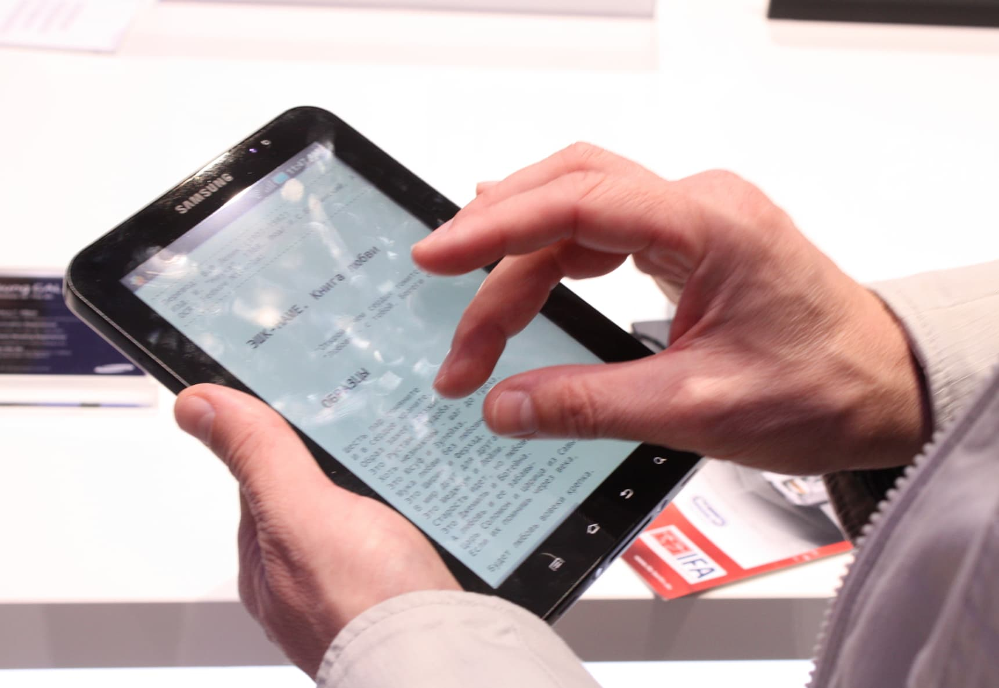

<!--
0.5 min

А сейчас наши сенсорные экраны распознают ~10 касаний и используют предиктивные алгоритмы.

Для них не нужны никакие стилусы, а управлять ими можно хоть в перчатках. Это — эргономика
-->

---

# Цели эргономики

 

<v-clicks>

**Повышение эффективности**
- улучшение производительности труда за счёт удобства использования инструментов, интерфейсов и рабочих процессов

**Улучшение комфорта**
- создание удобных рабочих мест, гаджетов и систем, соответствующих анатомии и психологии человека.

</v-clicks>

---

# Цели эргономики

 

<v-clicks>

**Обеспечение безопасности**
- снижение рисков травм, переутомления и профессиональных заболеваний

**Адаптация технологий**
- проектирование техники и интерфейсов с учётом человеческих возможностей и ограничений

</v-clicks>

---

# Эволюция и стагнация

Все, с чем мы взаимодействуем вокруг — эволюционирует, видоизменяется, улучшается, упрощается.

<v-click>

Но клавиатуры, почему-то замедлились в своей эволюции...

</v-click>

---

# Legacy of the legacy...

Logitech Craft, 2017

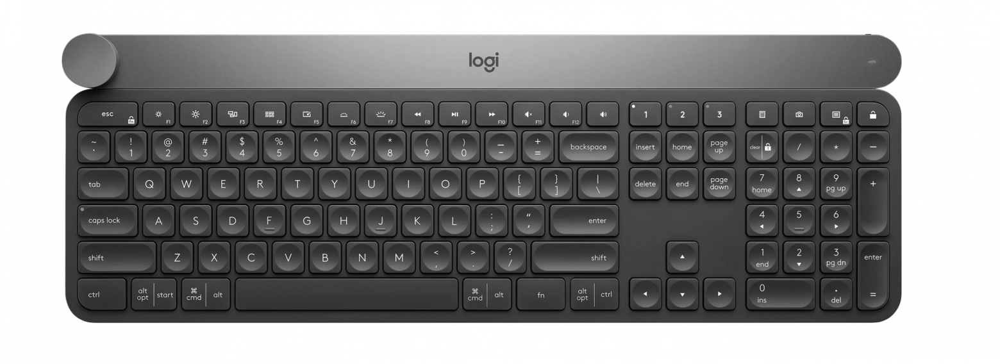

<!--
0.5 min

Возьмём довольно современную клавиатуру, вышедшую в 2017 году.

Это Logitech Craft — одна из топовых клавиатур и сейчас, но почему она так выглядит?
-->

---

# Legacy of the legacy...

Mitsumi KSX-3, 1997

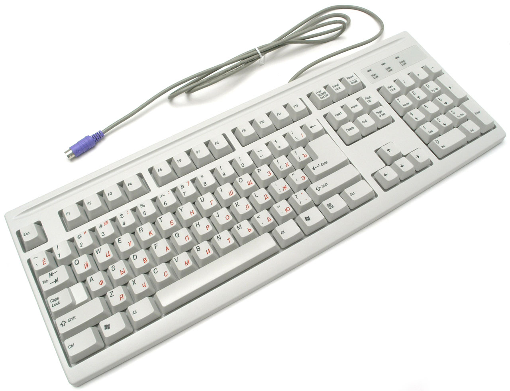

<!--
1.0 min

Сравним её с клавиатурой конца 90-х и, знаете, каких-то внушительных изменений мы не увидим

Да, Logitech стала тоньше, стала беспроводной, но это всё такой же «кирпич»
который не особо отличается от своего 20-летнего предка, а всё почему?
-->

---

# Legacy of the legacy...

IBM Model M, 1985

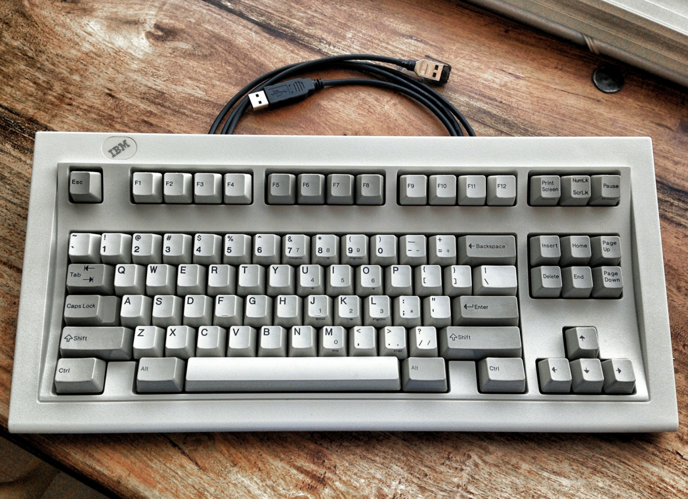

<!--
  А всё потому, что клавиатуры, которым уже 40 лет выглядели точно также.
-->

---

# Legacy of the legacy...

Apple One, 1976

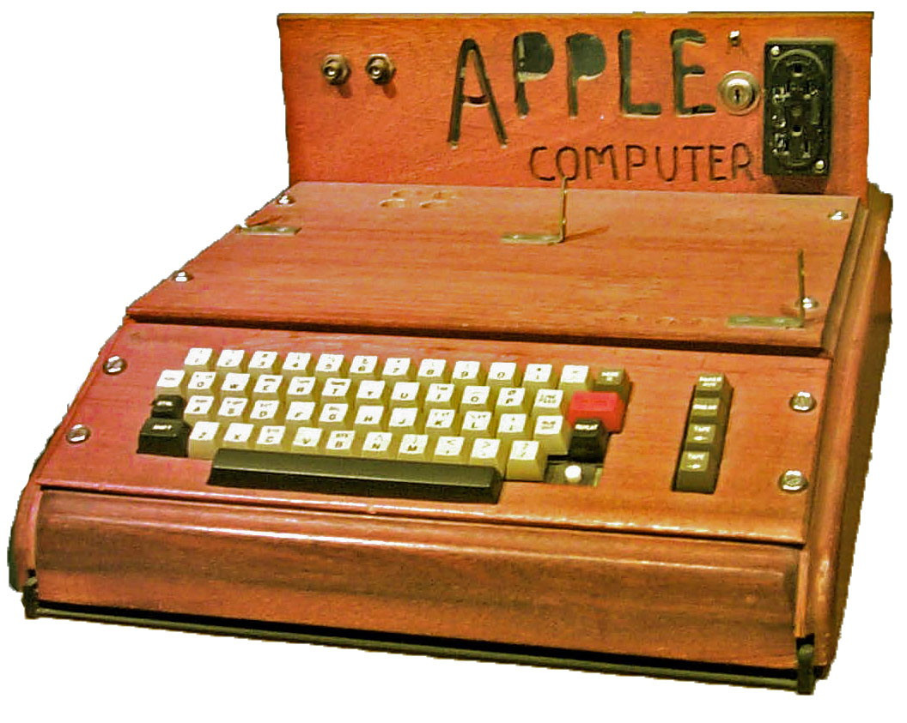

<!--
  А она выглядит почти как клавиатура компьютера Apple One 1976 года
-->

---

# Legacy of the legacy...

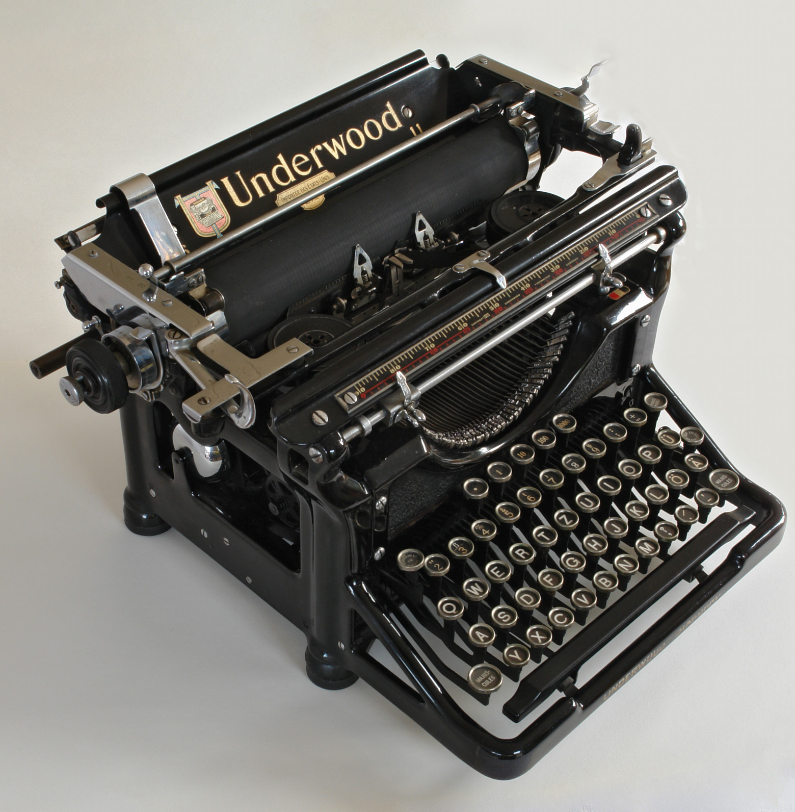

<!--
  А она выглядит так, потому что печатные машинки, которым вот-вот уже стукнет 130 лет выглядели точно также
-->

---

# Legacy of the legacy...

<!--
  А она... ну, вы поняли. Выглядит как первая коммерчески успешная QWERTY клавиатура, которой 150 лет
-->

---

# Что общего?

Горизонтальное смещение рядов

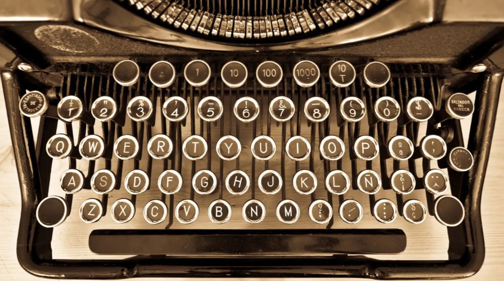

<!--
0.5 min

Давайте посмотрим, что у них всех общего? Горизонтальное смещение рядов.

Это было вынужденной мерой, которая решала проблему столкновения рычажков, но осталось
с нами (вдумайтесь) на 150 лет. На 50 лет дольше, чем это было технически обосновано...
-->

---

# Проблемы современных клавиатур

Первая проблема — это горизонтальное смещение клавиш — **стаггер**.

Это смещение неестественно для пальцев. Они у нас ровные, а не кусочно-диагональные.

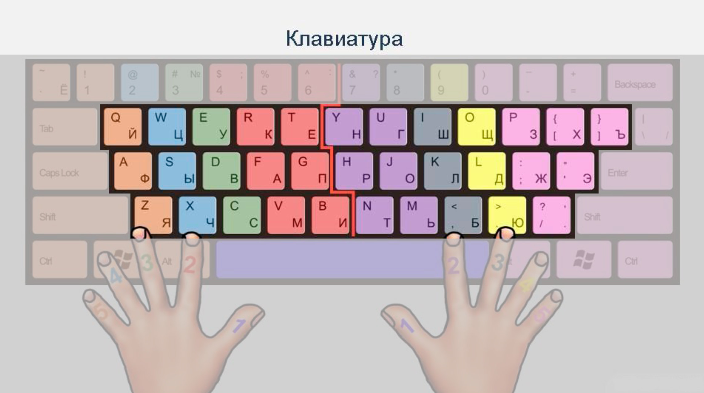

<!--
0.5 min

Если мы рассмотрим клавиатуру, то на ней первый ряд, где расположено QWERTY

смещён относительно второго ряда, где расположено ASDFG на четверть длины клавиши

А третий ряд смещён относительно второго на половину длины клавиши.

Получается своеобразная лесенка, но наши пальцы так 
не устроены, они ровные, а не кусочно-диагональные.
-->

---

# Проблемы современных клавиатур

Как решить проблему горизонтального стаггера?

Посмотрите на NumPad и то, как удобно на нём набирать цифры.

А всё потому, что клавиши вписаны в сетку.

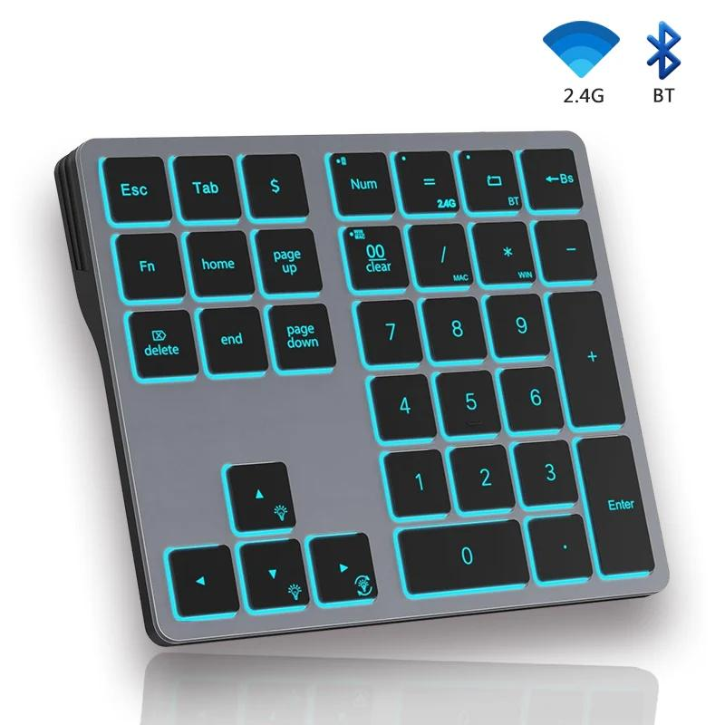

<!--
Нам ментально проще перемещать пальцы вверх-вниз / влево-вправо,

А не высчитывать в голове диагональные траектории со смещением 1/4 и 1/2...
-->

---

# Проблемы современных клавиатур

Как решить проблему горизонтального стаггера?

<v-click>

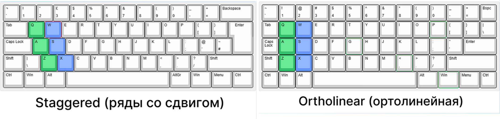

Меняем горизонтальный стаггер на ортолинейность.

</v-click>

<!--
  Для основного блока клавиатуры тоже существует
  решение, которое называется ортолинейность

  При такой форме, наши пальцы будут перемещаться
  вертикально ровно по сетке
-->

---

# Проблемы современных клавиатур

Вторая проблема — это закрытая поза с зажатой грудной клеткой и неудобным изгибом рук.

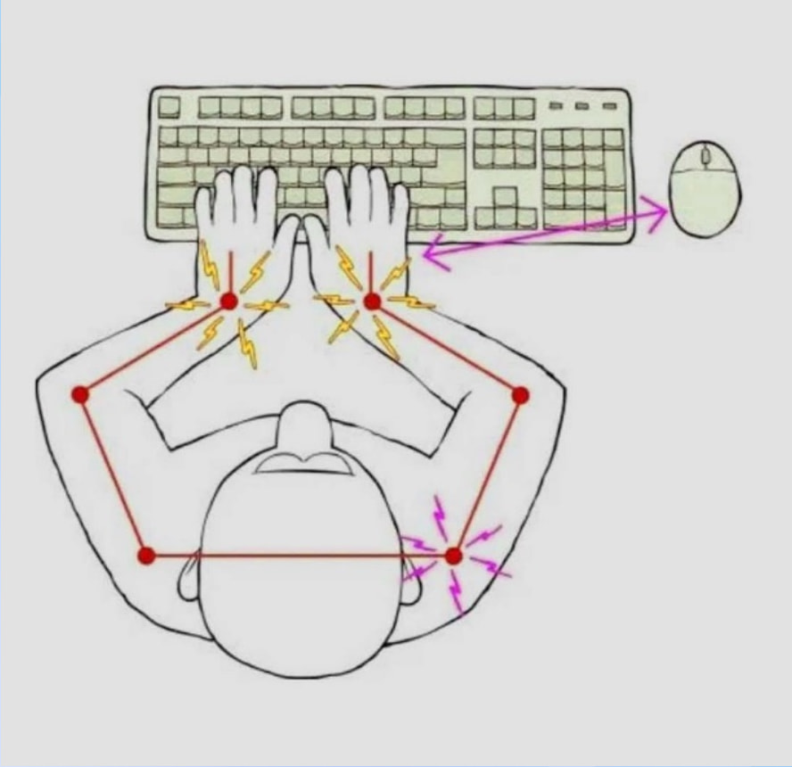

<!--
  В интернете зачастую рисуют такие картинки, однако, в реальности всё не так плохо.

  Клавиатура обычно смещена левее, чтобы разместить мышь справа

  Поэтому левая рука у вас будет расположена почти прямо, а вот правая — ещё больше выгнута
-->

---

# Проблемы современных клавиатур

Вторая проблема — это закрытая поза с зажатой грудной клеткой и неудобным изгибом рук.

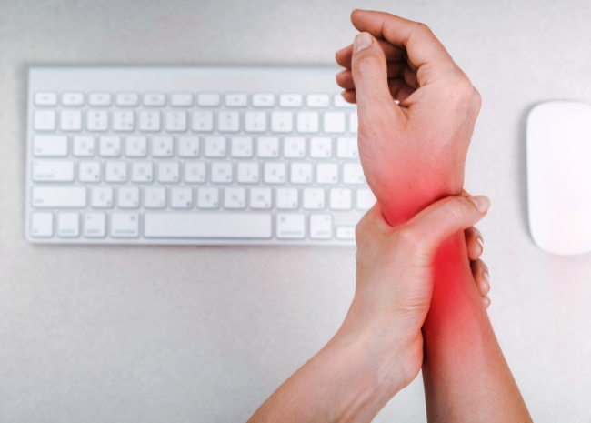

<!--
  Прибавляем к этому плохую эргономику мыши, при которой пережимаются нервы срединного канала

  Умножаем на время работы за компьютером и получаем почти идеальную формулу туннельного синдрома...
-->

---

# Проблемы современных клавиатур

Как решить проблему неправильной позы?

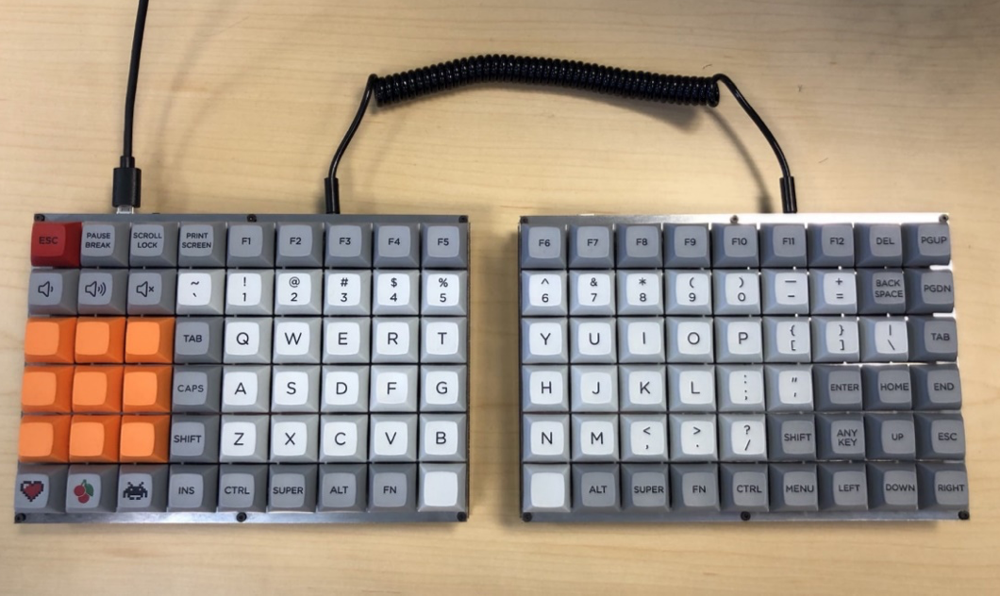

"Распиливаем" клавиатуру на половинки.

<!--
  Это позволит повернуть их под правильным углом, который будет комфортен именно вам.

  Хотите поближе? Пожалуйста! Хотите выпрямить логти и плечи раздвигаете половинки подальше.
-->

---

# Проблемы современных клавиатур

Как решить проблему неправильной позы?

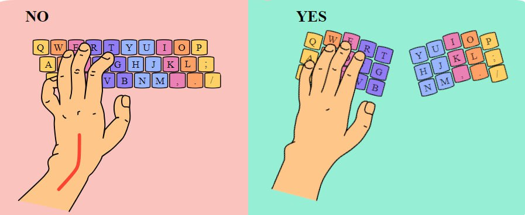

<!--
  И самое главное, ваши запястья будут ровными и не будут напряжены.
-->

---

# Приятный бонус (:

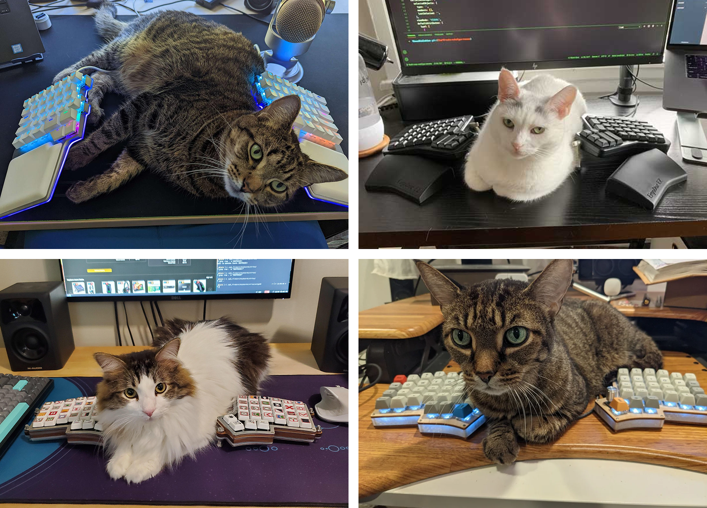

<!--
  А ещё, есть приятный бонус — можно посадить между ними своего любимого кота (:
-->

---

# А что предлагает Microsoft?

Клавиатура, в названии которой есть слово «Ergonomic»

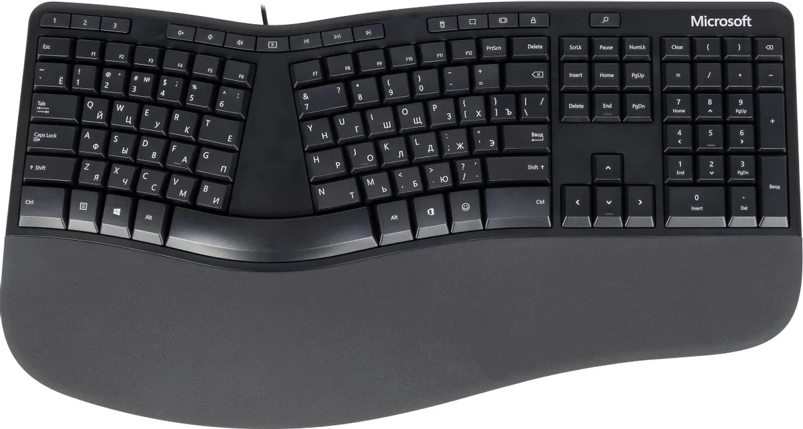

<!--
  Но есть довольно популярная клавиатура — Microsoft Ergonomic Keyboard
-->

---

# А что предлагает Microsoft?

Клавиатура, в названии которой есть слово «Ergonomic» — моносплит

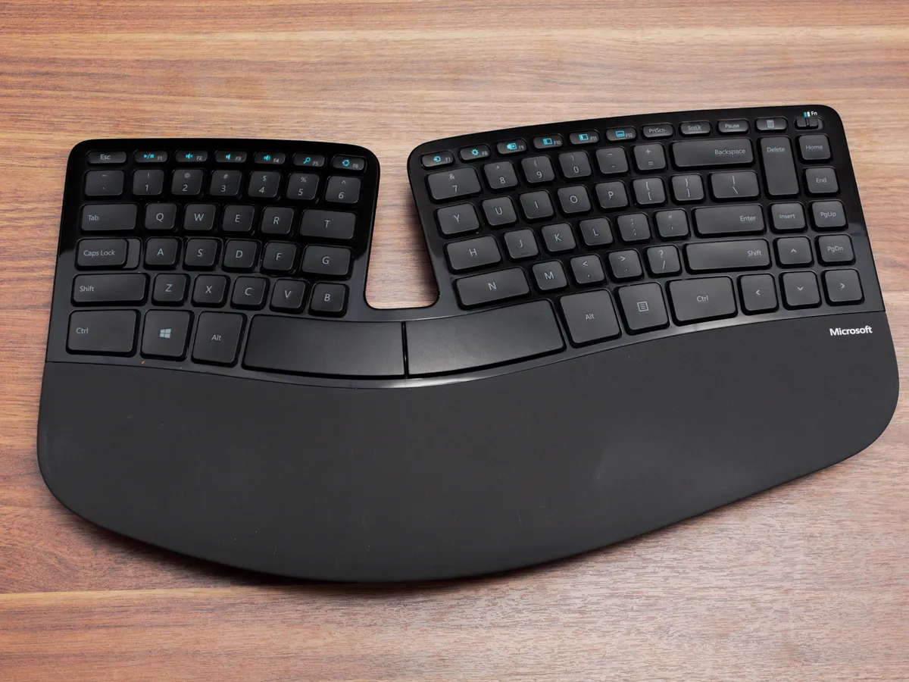

<!--
  Или её более новая версия — Microsoft Sculpt...

  Да, здесь мы видим то же самое смещение клавиш, как на стандартных клавиатурах.

  Однако, здесь клавиатура разделена на две половинки, но тем не менее, они находятся в одном блоке.

  Такая клавиатура называется «моносплитом». И является отличным вариантом для того,
  чтобы познакомиться с миром эргономичных клавиатур.
-->

---

# Проблемы современных клавиатур

Третья проблема — наши пальцы почему-то выглядят НЕ так:

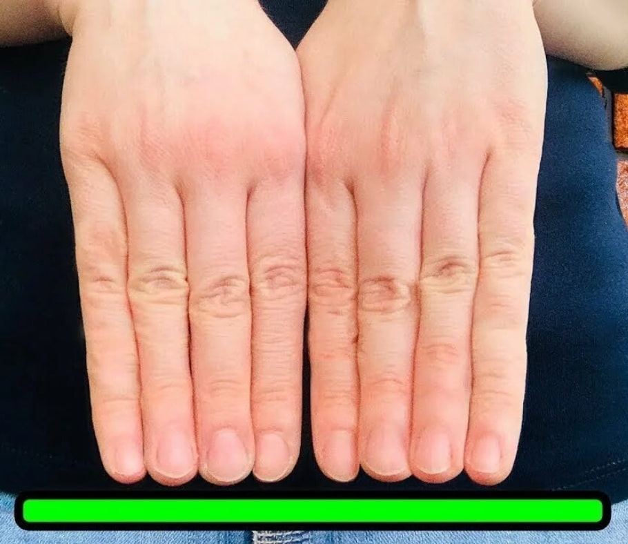

---

# Проблемы современных клавиатур

А вот так!

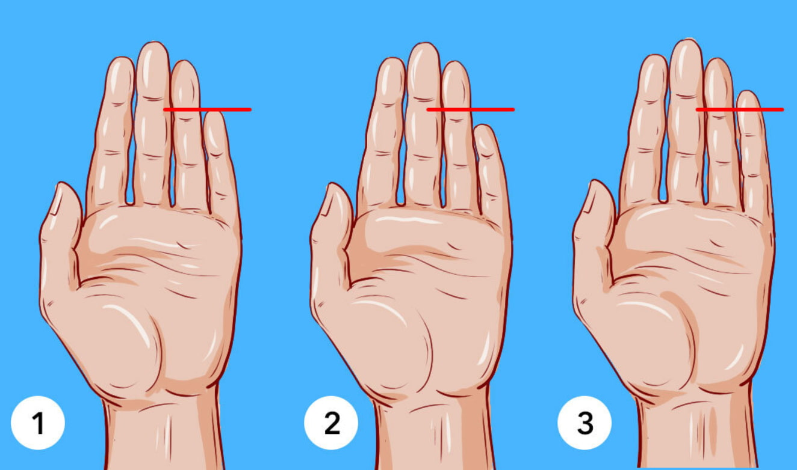

<!--
  Длина пальцев у всех разная, но клавиатуры будто бы об этом не в курсе...
-->

---

# Проблемы современных клавиатур

Как решить проблему разной длины пальцев?

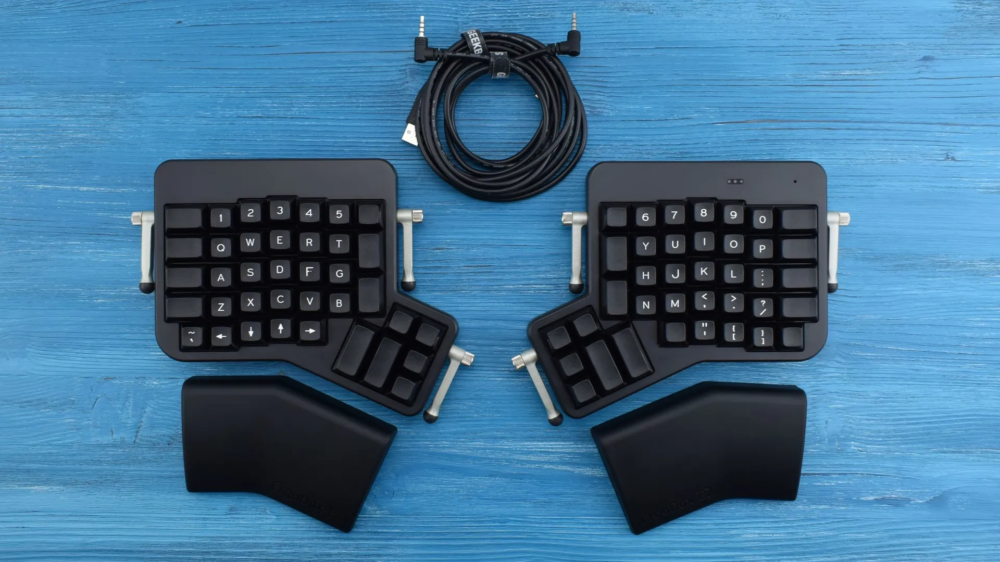

Добавляем вертикальный стаггер.

<!--
Вертикальное смещение колонок относительно друг друга учитывает разную длину пальцев

Оно бывает более или менее агрессивным, тут уже всё более-менее индивидуально...
-->

---

# Проблемы современных клавиатур

Как решить проблему разной длины пальцев?

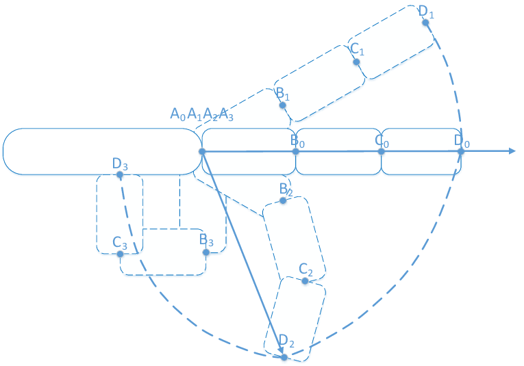

<!--
  Если зафиксировать положение ладони, то наши пальцы двигаются
  не горизонтально вверх-вниз, а по криволинейной траектории.
-->

---

# Проблемы современных клавиатур

Как решить проблему разной длины пальцев?

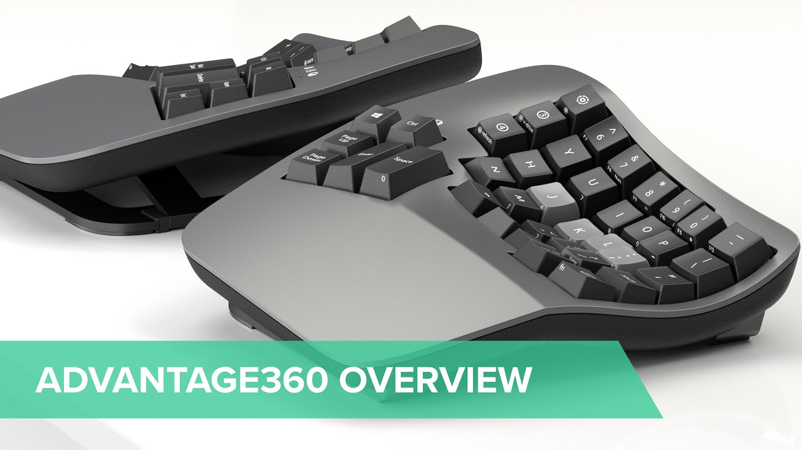

Добавляем вогнутость, в зависимости от длины пальцев

<!--
  Поэтому, в клавиатуре можно это учесть,
  добавив разную вогнутость, в зависимости от длины пальцев
-->

---

# Проблемы современных клавиатур

...

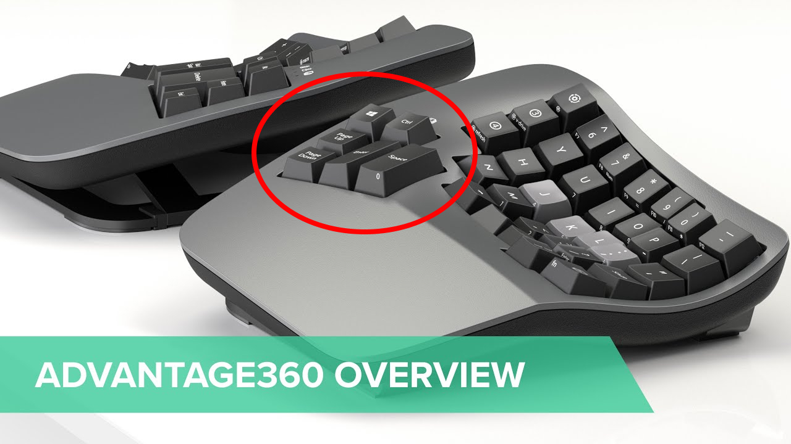

<!--
  Вы могли заметить, что на этой клавиатуре
  для большого пальца выделено ОЧЕНЬ много клавиш.

  И это не спроста!
-->

---

# Проблемы современных клавиатур

Проблема четвёртая — распределение нагрузки между пальцами.

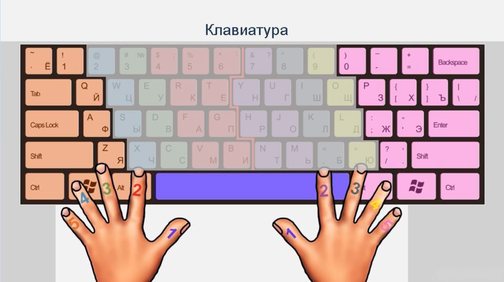

Большой палец, самый **сильный и подвижный**, занят всего одной клавишей — пробелом.

<!--
  Наш самый сильный и подвижный палец занят всего одной клавишей — пробелом!
-->

---

# Проблемы современных клавиатур

<!--
Представьте как вы вводите что-то на клавиатуре смартфона...

Скорее всего вы делаете это большими пальцами...
-->

---

# Проблемы современных клавиатур

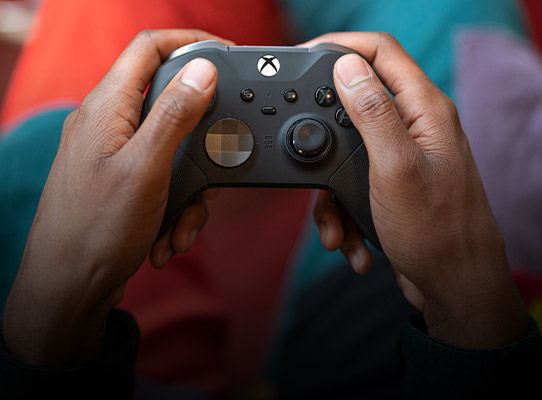

<!--
  А теперь представьте игровой контроллер. Какими пальцами управляете там?

  Все клавиши с стики, за исключением четырёх сверху управляются большими пальцами.
-->

---

# Проблемы современных клавиатур

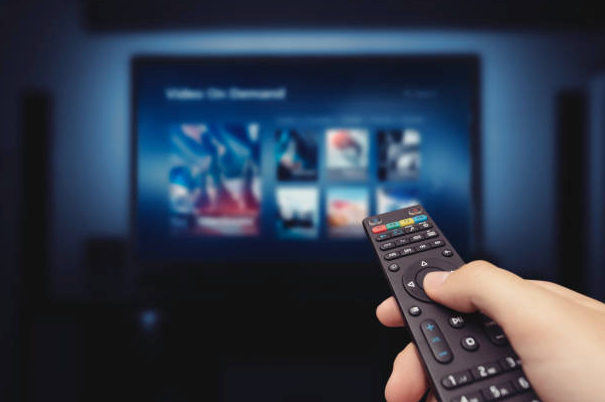

<!--
  Даже пульт от телевизора... Вы нажимаете все кнопки именно большим пальцем!

  Так почему-же на клавиатуре он занят всего одной клавишей — Пробелом ?!
-->

---

# Проблемы современных клавиатур

Проблема четвёртая — распределение нагрузки между пальцами.

А мизинец — самый слабый и менее подвижный палец...

Отвечает за **11 клавиш** на левой руке и **17 (!!!) на правой**.

<!-- И это я ещё не посчитал F-клавиши и Escape... -->

---

# Проблемы современных клавиатур

Как решить проблему распределения нагрузки?

1. Поместим под большой палец несколько клавиш.
2. Уменьшим количество клавиш для мизинца.

<v-click>

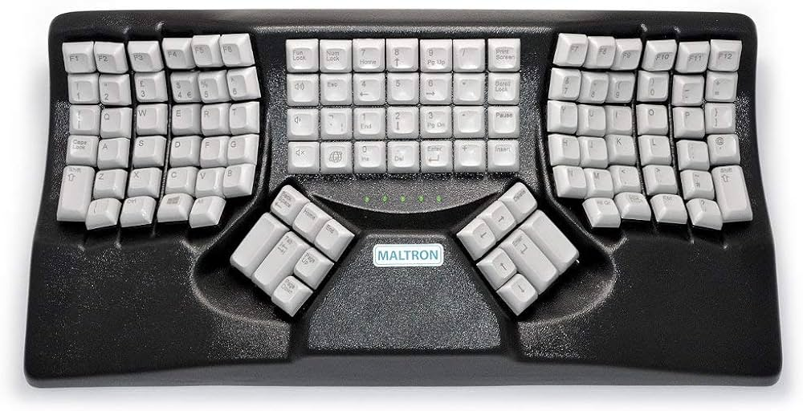

</v-click>

<!--
  Кстати, такое уже пытались сделать аж с 1977 года
  выпустив прототип Maltron Keyboard.

  Правда, они поместили под большой палец довольно странные клавиши — 
  Home, End, Backspace, Delete и стрелки.

  Видимо, в те времена это считалось удобным.
-->

---

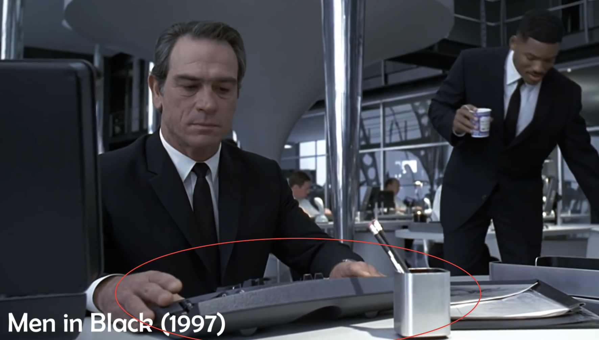

<!--
  Но такие клавиатуры были малосерийными и очень-очень дорогими.
  Они частенько светились в голливудских фильмах,
  но у простых людей на них денег не было.
-->

---

# А какие ещё есть варианты?

 

<v-click>

Для этого придётся разобраться в некоторых терминах

</v-click>

---

# Некоторые термины

**Домашняя позиция** — ряд клавиш, на котором рекомендуется располагать пальцы обеих рук пока вы **не печатаете**.

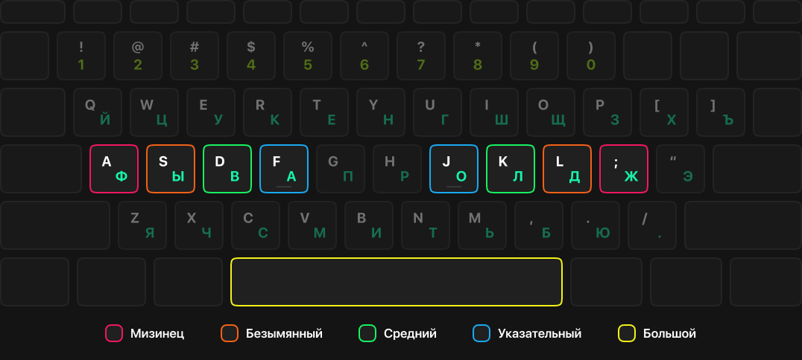

<v-click>

Такое расположение позволяет лучше ориентироваться по раскладке при слепой печати и сократить лишние движения пальцев.

</v-click>

<!--
  На клавишах домашней позиции обычно есть такие «рисочки» или «ямочки» для позиционирования указательных пальцев

  Логично, что при «слепой» печати гораздо проще перемещать пальцы относительно какого-либо ориентира.

  Также, когда руки находятся в этой позиции, среднее расстояние до каждой из клавиш — минимально.
-->

---

# Правило одной клавиши

В мире эргономичных клавиатур есть такое понятие, как «правило одной клавиши». Оно звучит так:

> «каждая клавиша должна находиться на расстоянии одной клавиши от домашней позиции»

 

<v-switch>
  <template #1>
    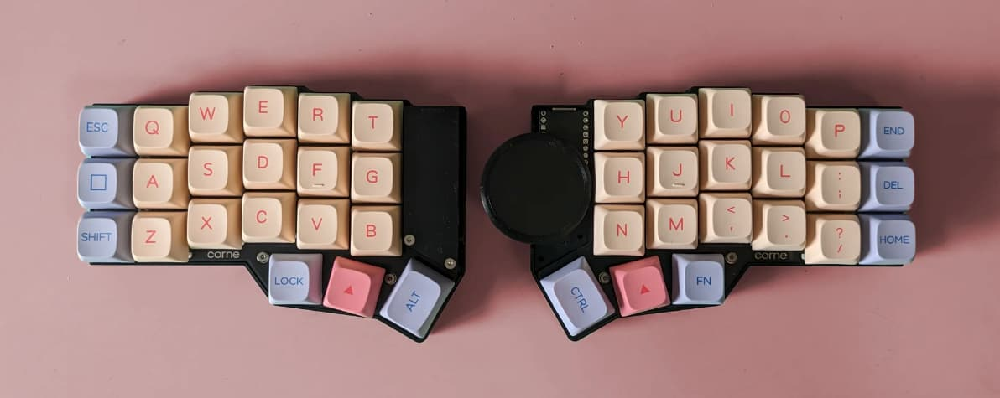
  </template>
  <template #2>
    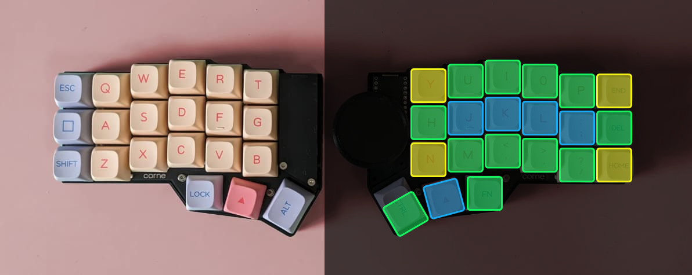
  </template>
</v-switch>

<!--
  Если применить это правило, то мы получим вот такую минималистичную клавиатуру, в которой всего 42 клавиши.

  Суть этого тотального уменьшения количества клавиш в том,
  чтобы свести перемещения пальцев, кистей и запястий к минимуму.
-->

---

# Проблемы современных клавиатур

Или «что курили» разработчики стандартной русской раскладки?

<v-clicks>

`,` `.` `:` `;` `"` `?`

Статьи:
- [Правильная русская клавиатура](https://tonsky.livejournal.com/318571.html)
- [Артемий Лебедев. Трагедия запятой](https://www.artlebedev.ru/kovodstvo/sections/105/)

</v-clicks>

<!--
  Посмотрите на это фото. Возможно, вы уже привыкли к этому хаосу и вас всё устраивает...
  А может быть вы, как и я когда-то, дико раздосадованы тем, что здесь происходит.

  Стандартная русская раскладка проектировалась по остаточному принципу,
  исходя из условия, что латинскую раскладку — менять нельзя.

  Это привело к тому, что в русской раскладке пунктуация (перечислить)
  расплоложена в других местах, нежели в английской.

  А кое-что в русской раскладке и вовсе нельзя набрать, например, одинарную кавычку.

  Когда-то в 2018 году, я наткнулся на проект, который обещал навести порядок в этом хаосе.
-->

---

<!--
  Эта раскладка незначительно меняла как русскую, так и английскую раскладки,
  внося, как мне показалось, логику и порядок.

  Все виды кавычек помещались на одну клавишу, все виды слэшей — на другую.

  Минусы, дефисы и тире — на третью, а знаки плюс, равно, не равно — на четвёртую.

  Запятая и точка в ней расположены на одном месте как в русском, так и в английском.

  А точка с запятой и двоеточие вводятся как Шифт+Запятая и Шифт+Точка. Красота!

  А ещё, цифровой ряд здесь поменян местами с символьным,
  то есть символы вводятся без Шифта, а цифры — с Шифтом.

  В программировании, символы используются гораздо чаще цифр.
-->

---

<!--
  Ох, а если зажать альт, то здесь просто глаза разбегаются...

  И стрелочки, и французские кавычки-ёлочки, и разнообразные математические символы

  Да, для этого пришлось пожертвовать бувами Ë и Ъ, которые вообще говоря, очень редки в русском языке.
-->

---

[Univesal Layout](https://github.com/braindefender/universal-layout) доступен для Windows, macOS и Linux (если у вас есть много свободного времени).

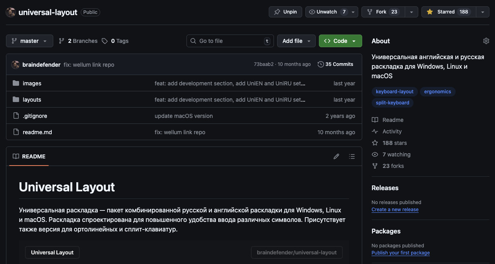

<!--
  Тот проект я развил, доработал под себя, адаптировал под Windows и Linux...

  И вуаля, его можно скачать и попробовать «логику в действии».
-->

---

# Что такое современная сплит-клавиатура?

И какими свойствами должна обладать

<v-clicks>

**Раздельная**. Можно настроить положение половинок как угодно.

**Эргономичная**. Учитывает положение рук и разную длину пальцев.

**Имеет Thumb-кластер**. Нагружает сильный и подвижный большой палец полезными функциями.

**(опц.) Беспроводная**. Возможность использовать с несколькими устройствами.

**(опц.) Умеет управлять курсором**. Исключает необходимость переносить руку на мышь и обратно.

**(опц.) Имеет ~42 клавиши**. Удовлетворяет «правилу одной клавиши от домашней позиции».

</v-clicks>

<!--
  Или, если взять в расчёт то, что мизинец — самый слабый и малоподвижный палец...
-->

---

# Или ещё меньше..?

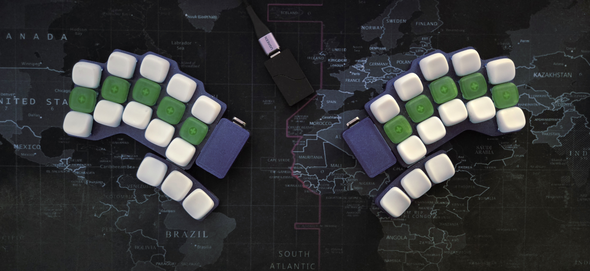

<!--
  То можно уменьшить клавиатуру ещё на одну колонку, получив всего 36 клавиш!

  Это, кстати, клавиатура под названием «Лапка»,
  которую я сам с нуля спроектировал,
  собрал, спаял — в общем, произвёл.

  Ей, кстати, пользуюсь не я один. Штук десять я собрал и продал, а ещё около
  пяти человек (это только те, о которых я в курсе) собрали её самостоятельно.
-->

---

# Но как таким вообще пользоваться?

<v-clicks>

- Клавиши без надписей! Как я буду знать что я нажимаю?

- Клавиш мало! Тут даже русский алфавит не влезает!

- Я вам что, пианист, чтобы играть арпеджио на клавиатуре?!

</v-clicks>

<v-click>

Ответ прост — **слои**!

</v-click>

<!--
  От людей, не сильно вовлечённых в подобные клавиатуры, я слышал такие возгласы...
-->

---

# Некоторые термины

Слой — это **дополнительный уровень раскладки** клавиатуры.

<v-click>

Слой может быть активирован:
- при нажатии на какую-либо клавишу (например, NumPad)
- при удержании определённой клавиши (например, Fn на ноутбуках)

</v-click>

<v-click>

Когда слой активирован, одни и те же клавиши принимают другое значение.

</v-click>

<v-click>

Shift — это тоже слой!

Цифровой ряд `1234567890`, при зажатии Shift превращается в `!@#$%^?*()` а строчные буквы превращаются в заглавные!

</v-click>

<!--
  Звучит сложно? Никто не любит эти Fn-клавиши, потому что они как-то разбросаны по клавиатуре..

  Но, даже используя совершенно обычную клавиатуру, вы на самом деле пользуетесь слоями...

  Поэтому, если грамотно расположить клавиши по слоям — этим будет удобно пользоваться!
-->

---

# Базовый слой

<!--
  Базовый слой — это слой, в котором клавиатура находится по-умолчанию

  Здесь, для всех пальцев, кроме большого, обычно располагают буквы.

  А под большим пальцем расположены «Пробел», «Шифт», а также клавиши слоя.
-->

---

# Навигационный слой

<!--
  Навигационный слой содержит в себе всё, что нужно
  для навигации и работы с текстом или интерфейсом.

  Здесь, на правой руке, расположены Backspace, Delete, стрелки, Home/End и Page Up/Down.

  На левой руке — клавиши переключения окон и рабочих столов, а также все клавиши-модификаторы

  Клавиши Escape, Enter и Tab продублированы как на левой, так и на правой руке.
  Они полезны во многих программах и хочется иметь возможность нажимать их одной рукой.
-->

---

# Символьный слой

<!--
  В символьном слое расположены, собственно, почти* все символы.

  Верхний ряд полностью дублирует то, что встречается на обычных клавиатурах.

  «Одинаковые» символы (вроде кавычек и слэшей) размещены блоками,
  а не разбросаны по всей клавиатуре, как это сделано в стандартной раскладке.

  Может показаться странным, что здесь также расположены клавиши-модификаторы,
  но об этом я расскажу чуть позже.
-->

---

# Альт-слой

<v-click>

`Alt + Е = Ë`

`Alt + Ь = Ъ`

`Alt + Ш = Щ`

</v-click>

<!--
  Здесь разместились все символы, которые не уместились в символьном слое.

  Те самые три русские буквы, которые не влезают в сетку 2×15

  — Ë, Ща и Твёрдый знак — тоже расположены здесь.

  При этом, они расположены вполне логично и запоминаются мнемонически.

  Бонусом, здесь расположены знак рубля и стрелочка => «равно + угловая скобка»,
  которая ну очень часто встречается в JavaScript.

  А ещё, здесь расположены мои любимые кавычки-ёлочки.
  В литературном русском языке используются именно они.
  На телефоне вы можете их ввести, а как их ввести с обычной клавиатуры?
  Правильно — никак!
-->

---

# Цифровой и функциональный слой

<!--
  Здесь находятся, собственно, цифры и F-клавиши.

  Во многих программах они зачастую используются
  с какими-нибудь модификаторами например `Ctrl+Alt+F7`.

  Поэтому на этом слое так много клавиш-модификаторов.

  Чтобы попасть на этот слой, нужно одновременно
  зажать большим пальцем клавиши `NAV` и `SYM`
-->

---

# Про клавиши-модификаторы

Эти клавиши — настроены по-особенному.

<v-clicks>

- При нажатии, они как бы «залипают» и кладутся в очередь
- Как только вы нажмёте любую другую клавишу не-модификатор очередь очистится

</v-clicks>

<v-click>

Пример: нам нужно нажать `Ctrl+Shift+T`, чтобы открыть только что закрытую вкладку

</v-click>

<v-clicks>

- На любой из рук зажимаем клавишу слоя
- Нажимаем `Ctrl` и `Shift` в любой последовательности
- Отпускаем клавишу слоя и нажимаем `T`

</v-clicks>

<!--
  Это может звучать страшно неудобно, пока не попользуешься этим пару дней.

  А затем будешь думать «Я что, действительно всю жизнь
  раскорячивал руку на пол-клавиатуры чтобы нажать этот хоткей?»
-->

---

# Игровой слой

<!--
  Можно задаться вопросом: а насколько такая
  клавиатура и раскладка вообще универсальны?

  Так вот, для игр у меня тоже есть свои слои...
-->

---

# Игровой слой

<!--
  ...в которых есть всё, почти всё, что нужно.

  А ещё, здесь затесались сервисные клавиши по типу
  управления Bluetooth'ом и перезагрузки клавиатуры.
-->

---

# Что предлагают современные эрго-клавиатуры?

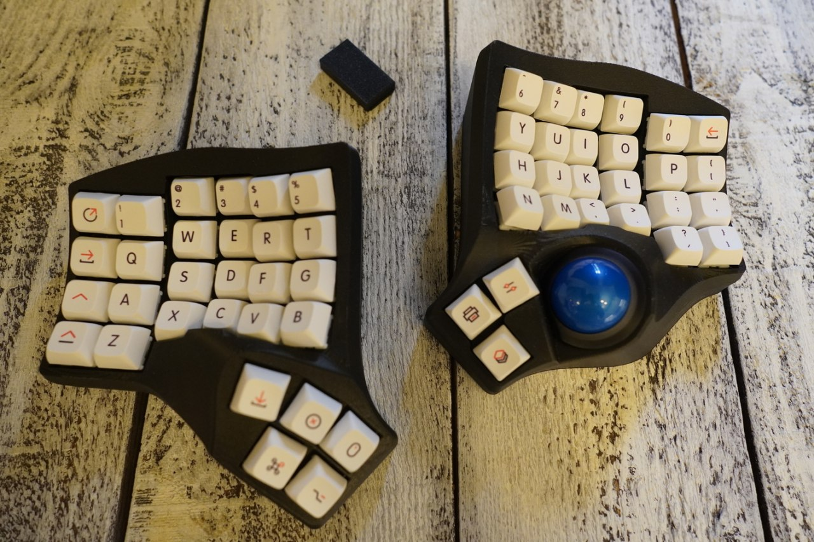

<!--
  Это клавиатура Charybdis (Харибда, по-русски).

  Она беспроводная, раздельная, эргономичная.

  Более того, в неё встроен трекбол, чтобы управлять
  курсором не отрывая руки от клавиатуры вовсе.

  Это фото с канала @ergosplits, который собирает такие клавиатуры.

  Так вот, жена одного из подписчиков взяла кисти и акриловые краски...
-->

---

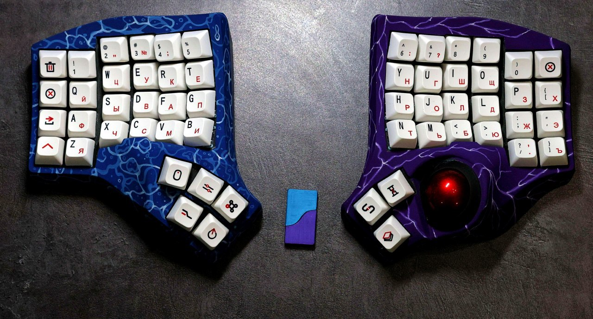

<!--
  ... и создала вот такую вот красоту.
-->

---

# Что предлагают современные эрго-клавиатуры?

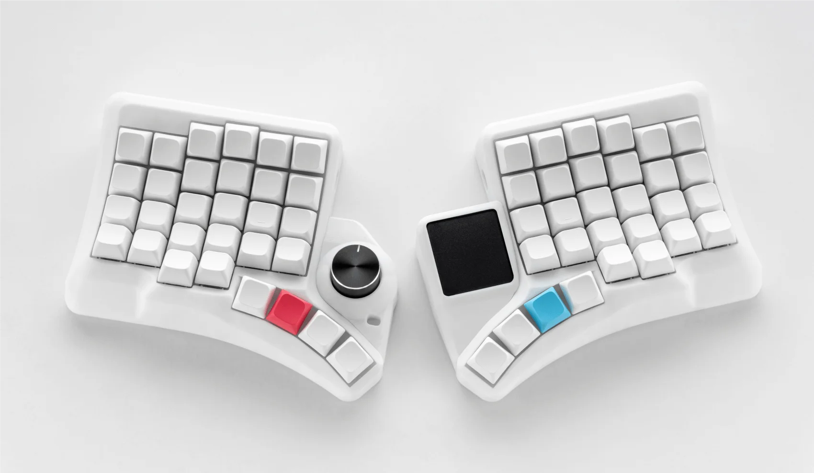

<!--
  Или вот такой вариант, где клавиатура является модульной.
  Можно подключить тач-пад, трекбол или крутилку громкости.
  Это, кстати, клавиатура от российских разработчиков — ErgoHaven.
-->

---

# Что предлагают современные эрго-клавиатуры?

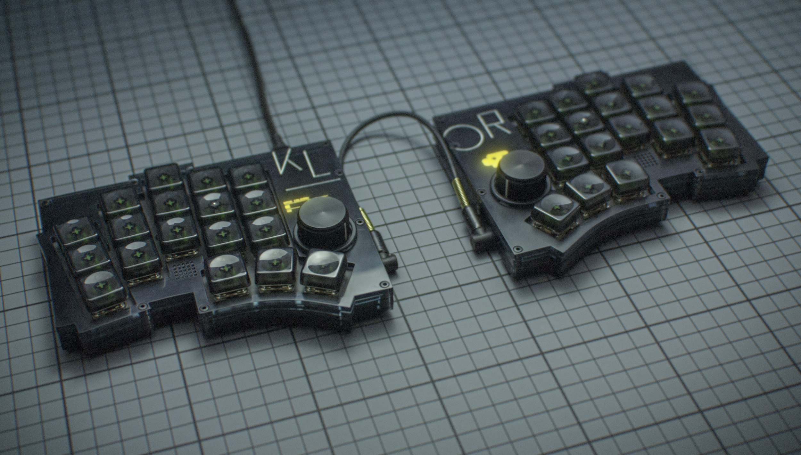

<!--
  Все предыдущие примеры были изготовлены с помощью 3D принтера,
  но сообщество этим не ограничевается и делает корпуса
  из более эстетичных и приятных на ощупь материалов.

  Например, KLOR — для которой существует акриловый и алюминиевый корпуса.
-->

---

# Что предлагают современные эрго-клавиатуры?

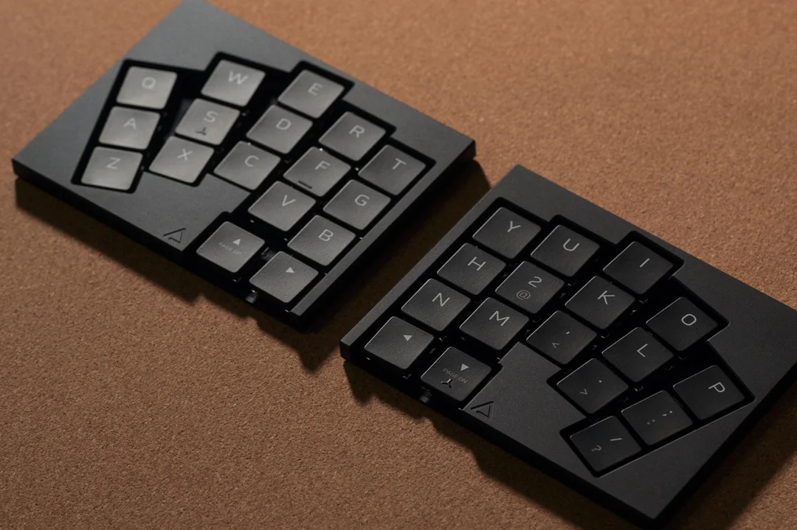

<!--
  Ну, а если вы любите минимализм и привыкли к ноутбучным клавиатурам,
  то есть и очень низкопрофильные варианты, как эта Delta Omega.
-->

---

# Плюсы и минусы.

Что вы НЕ получите, если перейдёте на эргономичную сплит-клавиатуру?

<v-clicks>

**Скорость**.

Сплит-клавиатуры — это в первую очередь про удобство, а не рекорды скорости.

Первые пару недель ваша скорость печати упадёт в несколько раз.

**Ультимативного решения**.

Нет какой-то волшебной клавиатуры, которая решит **все** ваши проблемы.

Но, теперь вы знаете что они (проблемы) есть. И знаете «куда копать», в поисках решения

</v-clicks>

<!--
  Но затем плавно восстановится или даже увеличится.

  Все мы разные. И потребности у нас тоже разные.
-->

---

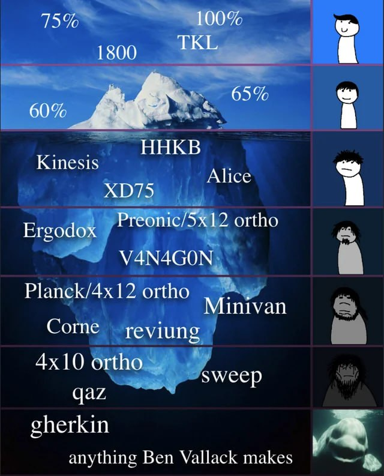

<!--
  И вообще, существует мем про то, насколько глубока эта нора.

  Здесь вы можете увидеть кучу названий разных клавиатур.

  Каждый «слой» решает какие-то проблемы предыдущего...

  ...и вносит ряд своих собственных.
-->

---

# Немного о «страшилках»

 

<v-clicks>

**Если я переучусь на сплит-клавиатуру, то не смогу больше пользоваться обычной**

- Мой результат: за 5 лет скорость на обычной клавиатуре снизилась на 12.5%

Ведь переход на такую клавиатуру — это не замещение старого навыка, а освоение нового.

</v-clicks>

<!--
  Существует предубеждение о том, что перейдя на свою собственную, странную клавиатуру,
  со временем, я забуду как пользоваться обычной, стандартной.

  Что ж, я решил проверить этот тезис: как раз, недавно, я был в гостях у друга.
  У него была такая «огромная стандартная клавиатура, с цифровым блоком, как полагается».
  На ней я никогда не печатал. Более того, я не печатал на стандартных клавиатурах уже пять лет.

  Я зашёл на клавиатурный тренажёр MonkeyType и провёл серию быстрых тестов на английском языке.
  Результаты меня порадовали: я начал с 42 WPM, а на пятый тест — уже печатал со скоростью 56 WPM.
  При этом, на своей клавиатуре, я печатаю в среднем 60-70 WPM.

  Что ж, падение скорости на 12.5% за пять лет — меня вполне устраивает.
-->

---

# Немного о «страшилках»

**Пытаясь найти то, что мне подходит, я потрачу кучу денег**

<v-click>

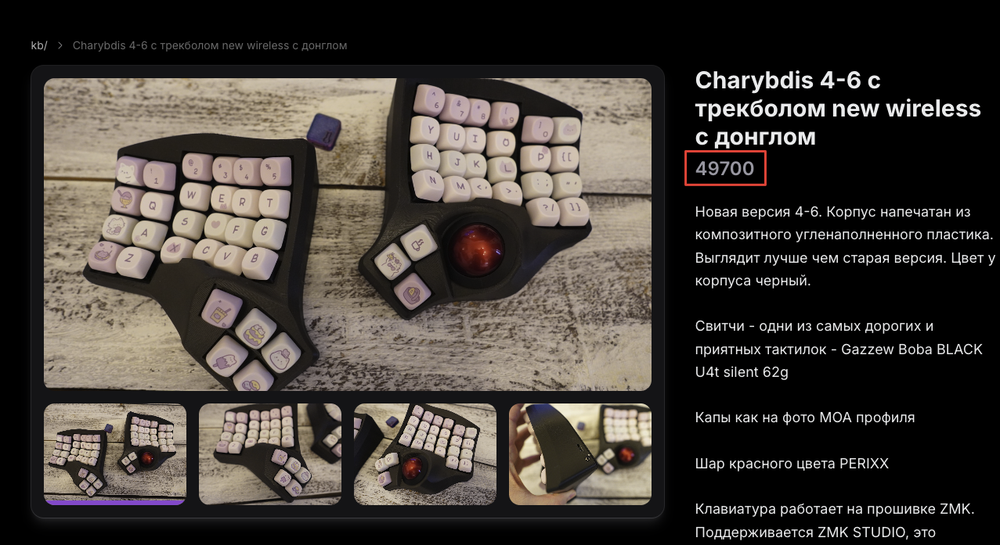

</v-click>

<!--
  Да, магазинные решения могут стоить в несколько раз дороже обычных клавиатур.
  А сделанные на заказ — ещё больше, потому что это не серийное производство,
  а ручная работа, подбор лучших комплектующих и т.д.
-->

---

# Немного о «страшилках»

**Пытаясь найти то, что мне подходит, я потрачу кучу денег**

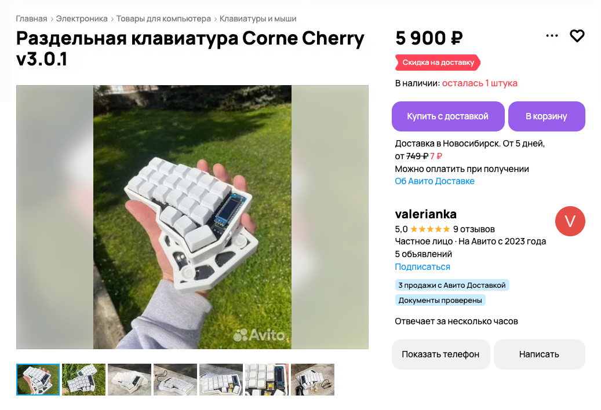

<!--
  Однако, таких же людей, которые пробуют различные варианты
  — много, поэтому всегда можно найти что-то на б/у рынке.

  К примеру, неделю назад я встречал клавиатуру, которая стоила не 25'000₽ как новая,
  а всего 10'000₽. Довольно неплохая скидка.

-->

---

# Немного о «страшилках»

**Пытаясь найти то, что мне подходит, я потрачу кучу денег**

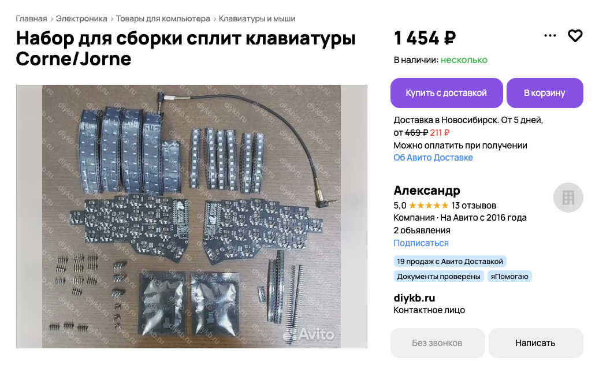

<!--
  А если у вас есть желание разобраться в электронике
  и вам не страшно подержать в руках паяльник...

  Или у вас есть друг с 3D-принтером...

  То можно собрать клавиатуру вручную вообще за пару-тройку тысяч рублей.
-->

---

# Плюсы и минусы.

Что вы получите, если перейдёте на эргономичную сплит-клавиатуру?

<v-clicks>

- Профилактику от различных болезней запястий
- «Защиту» своего рабочего места
- Тренировку мозга и моторики пальцев
- Неоднократные «вау», «круто» и «как я жил без этого?»
- Удовольствие от удобства использования инструмента

</v-clicks>

 

<v-click>

> Который спроектирован и настроен лично для вас.

</v-click>

<!--
  Подытожим. Что вы получите, если перейдёте на эргономичную сплит-клавиатуру?

  1. например, туннельного синдрома.

  2. ведь никто не знает какая у вас раскладка

  3. новые нейронные связи от изучения нового процесса

  5. Который спроектирован и настроен лично для вас.
-->
