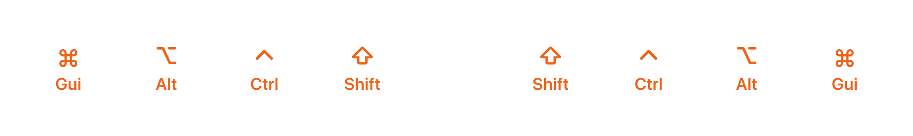

---

# Про клавиши-модификаторы

Эти клавиши — настроены по-особенному.

<v-clicks>

- При нажатии, они как бы «залипают» и кладутся в очередь
- Как только вы нажмёте любую другую клавишу не-модификатор очередь очистится

</v-clicks>

<v-click>

Пример: нам нужно нажать `Ctrl+Shift+T`, чтобы открыть только что закрытую вкладку

</v-click>

<v-clicks>

- На любой из рук зажимаем клавишу слоя
- Нажимаем `Ctrl` и `Shift` в любой последовательности
- Отпускаем клавишу слоя и нажимаем `T`

</v-clicks>

<!--
  Это может звучать страшно неудобно, пока не попользуешься этим пару дней.

  А затем будешь думать «Я что, действительно всю жизнь
  раскорячивал руку на пол-клавиатуры чтобы нажать этот хоткей?»
-->

---

# Игровой слой

<!--
  Можно задаться вопросом: а насколько такая
  клавиатура и раскладка вообще универсальны?

  Так вот, для игр у меня тоже есть свои слои...
-->

---

# Игровой слой

<!--
  ...в которых есть всё, почти всё, что нужно.

  А ещё, здесь затесались сервисные клавиши по типу
  управления Bluetooth'ом и перезагрузки клавиатуры.
-->

---
